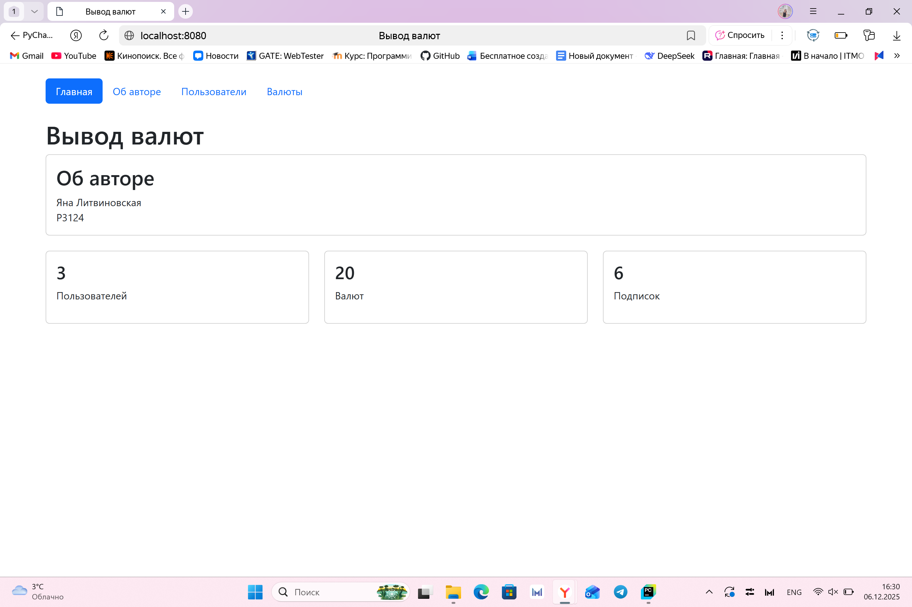
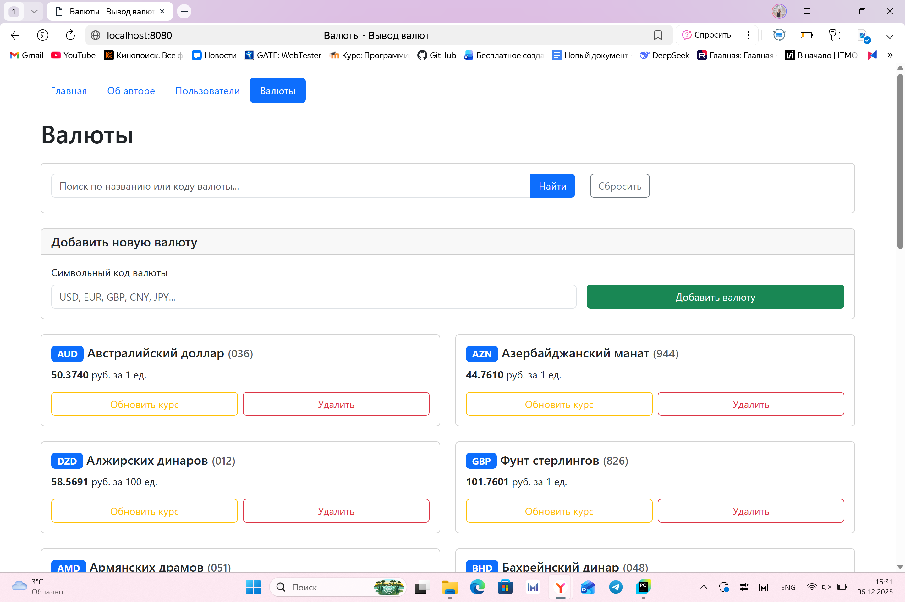
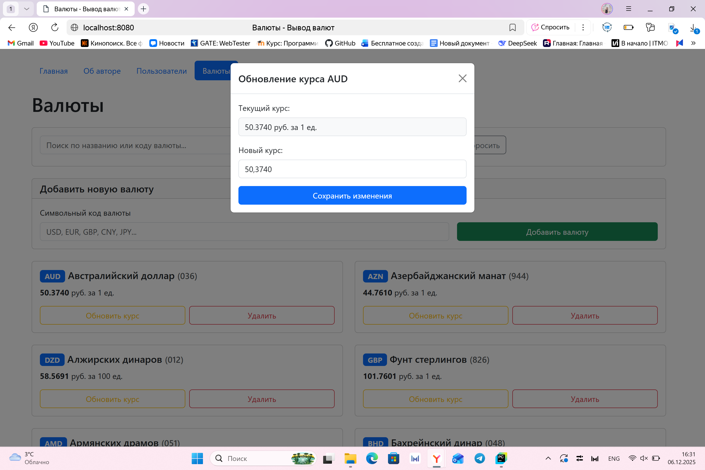
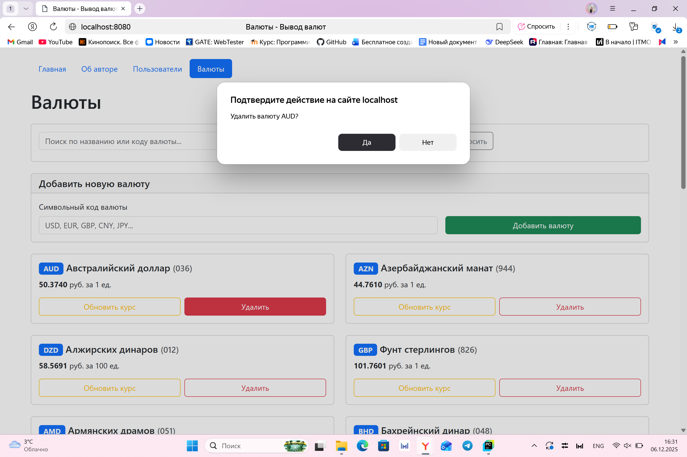

1. Цель работы

Реализовать CRUD (Create, Read, Update, Delete) для сущностей бизнес-логики приложения.

Освоить работу с SQLite в памяти (:memory:) через модуль sqlite3.

Понять принципы первичных и внешних ключей и их роль в связях между таблицами.

Выделить контроллеры для работы с БД и для рендеринга страниц в отдельные модули.

Использовать архитектуру MVC и соблюдать разделение ответственности.

Отображать пользователям таблицу с валютами, на которые они подписаны.

Реализовать полноценный роутер, который обрабатывает GET-запросы и выполняет сохранение/обновление данных и рендеринг страниц.

Научиться тестировать функционал на примере сущностей currency и user с использованием unittest.mock.

2. Модели, свойства и связи

##Модель Currency (Валюта):

id - первичный ключ (INTEGER)

num_code - цифровой код (TEXT)

char_code - символьный код, 3 буквы (TEXT)

name - название валюты (TEXT)

value - курс к рублю (REAL)

nominal - номинал (INTEGER)

##Модель User (Пользователь):

id - первичный ключ

name - имя пользователя

##Модель UserCurrency (Связь):

id - первичный ключ

user_id - внешний ключ к User

currency_id - внешний ключ к Currency

Связи: User (1) ↔ (n) UserCurrency (n) ↔ (1) Currency

3. Структура
   
```python
├── myapp.py                    # Главный файл приложения
├── requirements.txt           # Зависимости
├── models/                    # Модели данных
│   ├── __init__.py
│   ├── author.py            # Автор приложения
│   ├── user.py              # Пользователь
│   ├── currency.py          # Валюта (основная модель)
│   ├── app.py              # Приложение
│   └── user_currency.py     # Связь пользователей и валют
├── controllers/              # Контроллеры
│   ├── __init__.py
│   ├── databasecontroller.py  # Работа с SQLite
│   ├── currencycontroller.py  # Управление валютами
│   └── usercontroller.py     # Управление пользователями
├── templates/                # HTML шаблоны (View)
│   ├── index.html           # Главная страница
│   ├── users.html           # Пользователи
│   ├── currencies.html      # Валюты
│   └── author.html          # Об авторе
└── utils/                   # Вспомогательные модули
    ├── __init__.py
    ├── currencies_api.py    # API ЦБ РФ
    └── char_codes.py        # Получение кодов валют
```
4. Реализация CRUD с SQL-запросами
```python
#CREATE:
sql
INSERT INTO currency(num_code, char_code, name, value, nominal) 
VALUES(:num_code, :char_code, :name, :value, :nominal)
#READ:
sql
SELECT * FROM currency WHERE LOWER(name) LIKE ? OR LOWER(char_code) LIKE ?
#UPDATE:
sql
UPDATE currency SET value = ? WHERE id = ?
#DELETE:
sql
DELETE FROM currency WHERE id = ?
```
5. Примеры работы приложения:
   
   
   
   

6. Тесты с unittest.mock
   
```python
import unittest
from unittest.mock import MagicMock
from controllers.currencycontroller import CurrencyController

class TestCurrencyController(unittest.TestCase):
    def test_list_currencies(self):
        mock_db = MagicMock()
        mock_db.read_currencies.return_value = [
            {"id": 1, "char_code": "USD", "value": 90.0}
        ]
        controller = CurrencyController(mock_db)
        result = controller.list_currencies()
        self.assertEqual(result[0]['char_code'], "USD")
        mock_db.read_currencies.assert_called_once()

    def test_delete_currency(self):
        mock_db = MagicMock()
        mock_db.delete_currency.return_value = True
        controller = CurrencyController(mock_db)
        result = controller.delete_currency(1)
        self.assertTrue(result)
        mock_db.delete_currency.assert_called_once_with(1)
#Результаты тестов:

text
Всего тестов: 6
Успешно: 6
Провалено: 0
Ошибок: 0
```
7. Вывод

Приложение готово: есть создание, чтение, обновление и удаление валют. Работает с базой данных, отображает курсы из ЦБ РФ, имеет поиск и удобный интерфейс. Все функции работают, тесты проходят.

